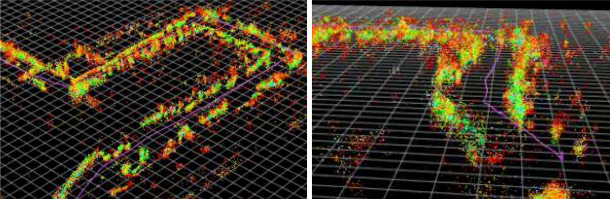

# Sensor Data Fusion Repository

Welcome to the Sensor Data Fusion repository. This project focuses on enhancing firefighter safety by developing a robust indoor localization system using multiple sensors such as radar, cameras, an IMU, and a pressure sensor. The system leverages sensor fusion techniques to ensure accurate 3D positioning even in extreme conditions.

<p align="center">



</p>

---
## Project Overview

The goal of this project is to combine data from multiple sensor modalities to achieve precise and robust indoor localization. The system integrates visual odometry, radar measurements, IMU data, and elevation changes from a barometer. By using Extended Kalman Filter (EKF)-based sensor fusion, the final output provides accurate pose estimation (position and orientation) even when individual sensors fail or provide unreliable data.

### Hardware

1. **Sensors**:
   - **2x Camera**: Captures visual data and provides motion estimation through visual odometry.
   - **2x IMU**: Provides angular velocity, and step counts supporting motion estimation and dead reckoning.
   - **4x Radar**: Measures the environment using radar point clouds to determine localization (x, y position). This project uses custom firmware for the radar system, available in the repository **mmWaveRadar**. The firmware is optimized for moving imaging 4D radar with person localization capabilities. It outputs a reliable 3D point cloud every 70ms with up to 180 points, covering a range of 0.3m to 8.4m in the field of view ±50° in both azimuth and elevation. Data is transmitted via USB UART.
   - **Barometer**: Measures atmospheric pressure, which is preprocessed to derive elevation (z position).
2. **Main Computer**: 
   - **Jetson Orin Nano Super**: Running Ubuntu 24.04 and ROS2 Humble.


## Repository Structure

The repository consists of separate ROS2 workspaces, each dedicated to a specific component:

- **visuslam_ws**: Visual odometry subsystem (MonoVisualSlam).
- **bender_ws**: 4D Radar localization subsystem (MultiRadar_Bender).
- **mmwave_ws**: TI mmWave radar ROS2 drivers (mmwave_ti_ros).
- **fusion_ws**: Sensor fusion, plotting, Visualization, pressure sensor, MTi Driver, and Step Counter nodes.

---

## Installation and Setup

### Clone the Repository

```bash
cd SensorFusion
```

### Build Each Workspace

Build each workspace individually from its directory:

```bash
cd ~/SensorFusion/visuslam_ws
colcon build

cd ~/SensorFusion/bender_ws/MultiRadar_Bender/MultiBender
colcon build


cd ~/SensorFusion/mmwave_ws/mmwave_ti_ros/ros2_driver
colcon build

cd ~/SensorFusion/fusion_ws
colcon build
```

After building, always source the `install/setup.bash` file of every workspace in each terminal before running any nodes.

---

# Launch Guide

All commands use full explicit paths from the `SensorFusion` project root. Start each process in a new terminal or terminal multiplexer tab.

## 1. Source Workspaces

In every terminal window:

```bash
source SensorFusion/visuslam_ws/install/setup.bash
source SensorFusion/bender_ws/MultiRadar_Bender/MultiBender/install/setup.bash
source SensorFusion/mmwave_ws/mmwave_ti_ros/ros2_driver/install/setup.bash
source SensorFusion/fusion_ws/install/setup.bash
```

## 2. Start Sensor Subsystems

Each process should be started in a new terminal. Wait a few seconds between launching radar nodes to avoid device conflicts.

### IMU (XSens MTi-320)
```bash
ros2 run xsens_driver xsens_driver_node --ros-args -p device:=/dev/ttyUSB0 -p baudrate:=921600
```

### Step Counter
```bash
ros2 run step_counter step_counter_node
```

### mmWave Radar Nodes
```bash
ros2 launch SensorFusion/mmwave_ws/mmwave_ti_ros/ros2_driver/src/ti_mmwave_rospkg/launch/6843AOP_Multi_0.py
# wait a few seconds
ros2 launch SensorFusion/mmwave_ws/mmwave_ti_ros/ros2_driver/src/ti_mmwave_rospkg/launch/6843AOP_Multi_1.py
# wait a few seconds
ros2 launch SensorFusion/mmwave_ws/mmwave_ti_ros/ros2_driver/src/ti_mmwave_rospkg/launch/6843AOP_Multi_2.py
# wait a few seconds
ros2 launch SensorFusion/mmwave_ws/mmwave_ti_ros/ros2_driver/src/ti_mmwave_rospkg/launch/6843AOP_Multi_3.py
```


### Camera Motion Vectors Publisher
```bash
ros2 launch mv_cpp mv_imu.py
```


### Pressure Sensor
```bash
ros2 run pressure_sensor_node pressure_sensor_node
```
If the node initializes with a large number, just restart it once.


## 3. Broadcast Static TF
```bash
ros2 run tf2_ros static_transform_publisher 0 0 0 0 0 0 odom base_link
```

## 4. EKF Sensor Fusion Node
```bash
ros2 run sensor_fusion sensor_fusion_node
```

## 5. Radar Bender Localization 
```bash
cd SensorFusion/bender_ws/MultiRadar_Bender/MultiBender/src/Bender_Location/launch
ros2 launch bender_radar_launch.py
```

## 6. Visual Odometry node
```bash
ros2 run mv_cpp imu_odometry
```

## 7. Visualization & Plotting

### RViz Visualization
```bash
cd SensorFusion/fusion_ws/src/fusion_plotter/fusion_plotter
python3 rviz_visualizer_node.py
```

### RViz2
```bash
rviz2
```

### UWB CSV-to-Covariance Path for RViz (Opitional if you want to visualize the UWB tracking resluts with Rviz directly )
```bash
cd SensorFusion/fusion_ws/src/fusion_plotter/fusion_plotter
python3 uwb_path.py
```

### Data Plotting
```bash
ros2 run fusion_plotter fusion_plotter_node
```

---
# Performance Optimization

## Tuning and Calibration

- **Process Noise (Yaw and Acceleration) in the Fusion Node:** Controls filter trust in system model vs. measurements. Increasing these makes the filter adapt faster but adds noise; decreasing smooths output but slows response.  
- **Measurement Noise (Fusion Node):** Defines how much the EKF trusts sensor measurements over predictions; tuning this balances filter stability and responsiveness.  
- **ICP Scale (Bender ICP Node):** Adjusts influence of radar pose corrections. Higher values increase radar trust but may cause instability if data is noisy.  
- **Motion Vector Translation Scale (Visual Odometry Node):** Scales visual odometry displacement; tune if motion is under- or overestimated.  
- **Step Length (Fusion Node):** Calibrates step counter displacement to actual distance walked.  
- **Delay Parameters (Fusion Node):** Fine-tune sensor data timing offsets to improve synchronization; estimate delays using the Fusion Plotter.  
- **Fusion Buffer Timing (Fusion Node):** Usually set to ~10 ms; controls processing and publish rate of the fusion node, affecting latency and update speed.

Proper adjustment of these parameters improves accuracy, stability, and real-time performance.


## Best Practices 

- Launch radar nodes **one at a time**, waiting for each to fully start, especially the fourth radar.  
- When closing radar nodes, pause briefly between each to avoid device conflicts.  
- If a radar node malfunctions, unplug it, toggle its programming switch off/on, wait a few seconds, reconnect, and restart.  
- Ensure all USB connections (sensors, cameras, radars, pressure sensor, IMUs) match the expected assignment in the code; miswiring causes incorrect data or alignment issues.  
- The pressure sensor node may initially output large values; restart the node once to stabilize readings near zero.

---

# Images and Videos

The repository contains an `images` folder and a set of demonstration videos for reference. These resources can help users understand the system setup, testing environment, and evaluation process.  
**They are optional, not required for running the software.**

## Images (found in `images/`)

- Photos of the complete, real physical system mounted on the SCBA (3 images).
- CAD renderings showing the full assembled system design from different perspectives (3 images).
- A building floor plan (House 20) used for testing and calibration.
- A map with all test points highlighted on the building layout.
- Screenshots visualizing live path with point clouds while mapping the lap area in House 20 (2 images).
- Final fused path from a lap on the ground floor and a lap on the first floor (3 images).
- A flowchart illustrating the full algorithm and code structure for sensor fusion.
- An illustration showing the integration of the extended Kalman filter logic within the fusion node.
- Diagram of the complete ROS2 software architecture for the system.

## Videos (in the project root)

- **Perfect Lap 1**: Complete, uninterrupted system run demonstrating optimal performance in the test environment.
- **Perfect Lap 2**: Second full lap with ideal sensor fusion output and minimal error.
- **Live Run 1**: Real-time recording of a live system run with live camera stream and motion vectors in ground floor lap (House 20).
- **Live Run 2 (UWB)**: Live run using the UWB reference system for validation, highlighting both ground truth and sensor fusion outputs.

---

For detailed background, system design, and methodology, please refer to the accompanying master thesis "Multi Sensor Data Fusion for Indoor Localization.pdf".
