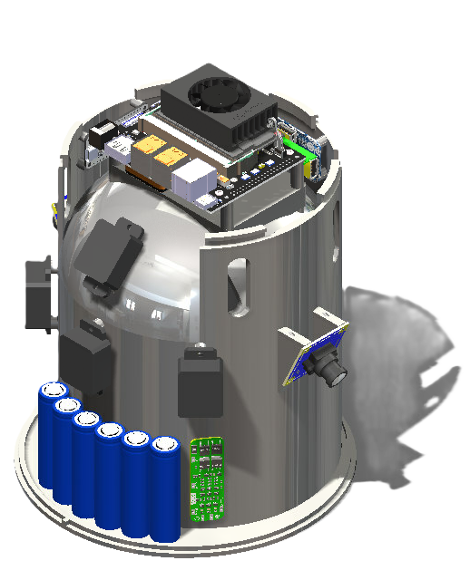
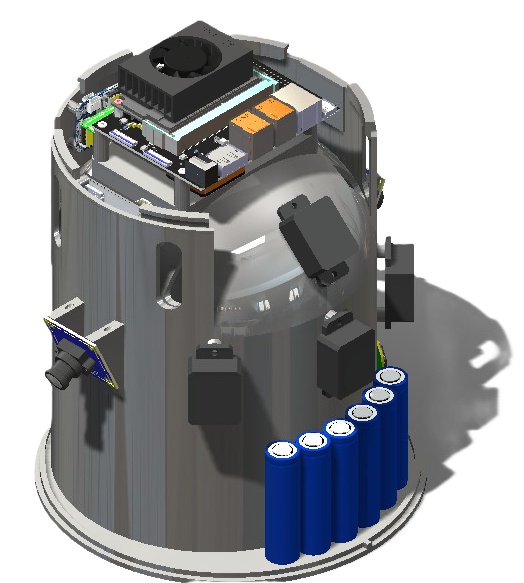
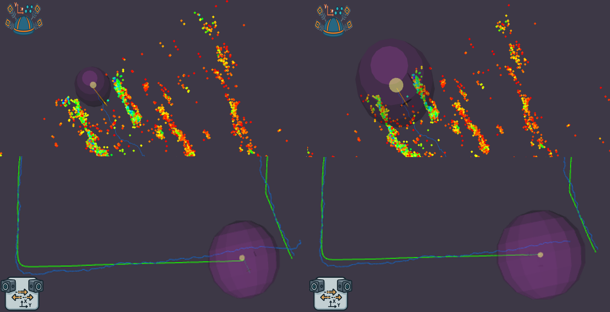

# 3D SLAM: Multi-Sensor Fusion for Real-Time Indoor Localization

<p align="center">

</p>

---

## 🎯 Project Overview

**3D SLAM** is an advanced multi-sensor fusion system designed for **real-time indoor localization and mapping** in GNSS-denied environments. This system is engineered for applications requiring robust positioning where GPS fails: inside buildings, underground facilities, dense urban areas, and hazardous environments.

### Target Applications

- **🚁 Robotics & Drones**: Autonomous navigation in GPS-denied spaces
- **👨‍🚒 First Responders**: Firefighters operating in smoke-filled buildings
- **🪖 Military Operations**: Soldier tracking in urban and indoor combat zones
- **🏗️ Industrial**: Worker safety in complex facilities and construction sites
- **🔬 Research**: Indoor SLAM benchmarking and sensor fusion studies

### The Challenge

Traditional localization methods fail in critical scenarios:
- GPS signals cannot penetrate buildings, tunnels, or underground spaces
- Visual systems become blind in smoke, darkness, or dust
- Inertial sensors drift rapidly without external references
- Single-sensor approaches lack redundancy when conditions degrade

**This system solves these challenges through intelligent multi-sensor fusion.**

---

## 🌟 Key Features

### Multi-Sensor Integration
- ✅ **mmWave Radar (4×)**: Operates in complete darkness and smoke
- ✅ **Dual Cameras**: High-frequency visual odometry via motion vectors
- ✅ **Precision IMU**: Sub-degree orientation accuracy with Xsens MTi-320
- ✅ **Barometric Sensor**: Vertical positioning across multiple floors
- ✅ **Step Counter**: Human motion tracking independent of environment

### Performance Highlights
- 🎯 **Sub-Meter Accuracy**: <0.5m horizontal, <0.3m vertical error
- ⚡ **Real-Time Operation**: <10ms fusion latency at 200Hz prediction rate
- 🔄 **Fault Tolerance**: Maintains functionality when individual sensors fail
- 📊 **Dynamic Uncertainty**: Adaptive covariance based on sensor confidence
- 🗺️ **3D Mapping**: Accumulated point cloud visualization of environment

### System Robustness
- 🌫️ **Smoke Resilient**: Radar maintains tracking when vision fails
- 🌙 **Darkness Operation**: No lighting requirements
- 📶 **Infrastructure-Free**: No external beacons or anchors needed
- 🔋 **Portable**: Self-contained with 4+ hour battery runtime
- 🎒 **Compact**: SCBA-mountable design for human operators

---

## 🏗️ System Architecture

The system implements a modular **Driver → 3D SLAM → Visualization** architecture built on ROS 2:

<p align="center">

</p>

### Architecture Layers

```
                                        ┌─────────────────────────────────────────────────────────────┐
                                        │                    DRIVER LAYER                             │
                                        │  • 4× Radar Point Cloud Publishers                         │
                                        │  • 2× Camera Motion Vector Extractors                      │
                                        │  • 2× IMU Interfaces (Orientation + Steps)                 │
                                        │  • Barometric Altitude Publisher                           │
                                        └─────────────────────────────────────────────────────────────┘
                                                                  ↓
                                        ┌─────────────────────────────────────────────────────────────┐
                                        │                    3D SLAM LAYER                            │
                                        │  • Radar Preprocessing & Filtering                         │
                                        │  • ICP Point Cloud Registration                            │
                                        │  • Visual Odometry Pose Estimation                         │
                                        │  • Extended Kalman Filter (EKF) Fusion                     │
                                        │  • Dynamic Covariance Scaling                              │
                                        │  • Asynchronous Measurement Handling                       │
                                        └─────────────────────────────────────────────────────────────┘
                                                                  ↓
                                        ┌─────────────────────────────────────────────────────────────┐
                                        │                 VISUALIZATION LAYER                         │
                                        │  • Real-Time Trajectory Plotting                           │
                                        │  • Point Cloud Accumulation                                │
                                        │  • Covariance Ellipsoid Display                            │
                                        │  • Multi-Sensor Path Comparison                            │
                                        │  • RViz2 3D Visualization                                  │
                                        └─────────────────────────────────────────────────────────────┘
```

### Extended Kalman Filter Design

The heart of the system is a custom **8-state EKF** implementing constant velocity and constant yaw-rate motion model:

<p align="center">

</p>

**State Vector**: `[x, y, z, vx, vy, vz, ψ, ψ̇]`
- Position (x, y, z) in meters
- Velocity (vx, vy, vz) in m/s
- Yaw angle (ψ) and yaw rate (ψ̇)

**Key Innovations**:
1. **Dynamic Covariance Scaling**: Sensors report confidence with each measurement
2. **Fusion Buffer**: Priority queue handles asynchronous, out-of-order data
3. **Constant Delay Compensation**: Sensor-specific latency correction
4. **Nonlinear Step Updates**: Euclidean displacement from step counter

---

## 🔧 Hardware Components

### Sensor Suite

| Component | Model | Qty | Function | Rate |
|-----------|-------|-----|----------|------|
| **mmWave Radar** | TI IWR6843AOP | 4 | 3D point clouds | 20 Hz |
| **USB Camera** | ELP (Sony sensor) | 2 | Motion vectors | 25 Hz |
| **IMU (Primary)** | Xsens MTi-320 | 1 | Orientation | 200 Hz |
| **IMU (Steps)** | Adafruit BNO085 | 1 | Step counting | 1 Hz |
| **Barometer** | Bosch BMP390 | 1 | Altitude | 20 Hz |

### Radar Configuration

The **4D mmWave radar subsystem** uses custom firmware (available in `mmWaveRadar` repository):
- **Coverage**: ±50° azimuth/elevation FOV
- **Range**: 0.3m to 8.4m
- **Output**: Up to 180 points per scan every 70ms
- **Mounting**: 4 radars at 0°, 45° up, 135° left, -135° right

### Computing Platform

- **Processor**: NVIDIA Jetson Orin Nano Super
  - 6-core ARM CPU @ 2.0 GHz
  - 8 GB RAM
  - Ubuntu 24.04 LTS
  - ROS 2 Humble
- **Power**: 3S2P Li-ion pack (6× 18650 cells)
- **Runtime**: 4+ hours continuous operation
- **Interfaces**: 4× USB 3.0, USB-C, DisplayPort

### Mechanical Design

<p align="center">



</p>

**Features**:
- 3D-printed PLA chassis with brass heat-set inserts
- Cylindrical design for SCBA mounting
- Sensor-specific cutouts with fixed orientations
- Integrated battery compartment
- Cable routing channels
- Total weight: ~2.5 kg with batteries

### Coordinate Frame System

<p align="center">

</p>

The system uses a rigorous **TF (Transform) tree** to maintain spatial consistency across all sensors:

**Key Frames**:
- **`odom`**: Global reference frame, fixed at system start (origin: 0,0,0)
- **`base_link`**: Body-fixed frame attached to the SCBA mounting unit
- **`base_imu`**: Primary IMU orientation reference (aligned with base_link)
- **`ti_mmwave_{0,1,2,3}`**: Individual radar sensor frames with calibrated orientations
- **`camera_frame_{1,2}`**: Left and right camera frames (tilted 25° downward)

**Calibrated Transforms**:
All sensors maintain fixed, pre-calibrated spatial relationships to `base_link`. This eliminates the need for online extrinsic calibration and ensures consistent multi-sensor fusion. The radar array provides 360° horizontal coverage with partial vertical FOV, while cameras capture motion-rich floor regions for visual odometry.

**TF Broadcasting**: Static transforms are published at system launch, with dynamic `odom → base_link` updated by the EKF at 100Hz.
---

## 📁 Repository Structure

The project is organized into **four ROS 2 workspaces**:

```
SensorFusion/
├── visuslam_ws/          # Visual Odometry Subsystem
│   └── src/
│       └── mv_cpp/       # Motion vector extraction & pose estimation
├── bender_ws/            # Radar Localization Subsystem
│   └── MultiRadar_Bender/
│       └── MultiBender/
│           └── src/
│               └── Bender_Location/  # ICP, preprocessing, filtering
├── mmwave_ws/            # TI Radar Drivers
│   └── mmwave_ti_ros/
│       └── ros2_driver/
│           └── src/
│               └── ti_mmwave_rospkg/  # 4× radar publishers
├── fusion_ws/            # 3D SLAM Fusion & Visualization
│   └── src/
│       ├── sensor_fusion/           # EKF fusion node
│       ├── fusion_plotter/          # Plotting & visualization
│       ├── step_counter/            # Step count publisher
│       ├── pressure_sensor_node/    # Altitude publisher
│       └── xsens_driver/            # MTi-320 IMU driver
└── images/               # Documentation images
```

### Key Directories

- **`visuslam_ws`**: H.265 motion vector extraction, visual odometry node
- **`bender_ws`**: Multi-radar preprocessing, ICP registration, point cloud accumulation
- **`mmwave_ws`**: Factory TI radar drivers with custom configuration
- **`fusion_ws`**: Core EKF sensor fusion, visualization, auxiliary sensors

---

## 🚀 Installation and Setup

### Prerequisites

- **OS**: Ubuntu 24.04 LTS (recommended for Jetson)
- **ROS**: ROS 2 Humble
- **Hardware**: NVIDIA Jetson Orin Nano (or compatible x86_64 system)

### System Dependencies

```bash
# Update system
sudo apt update && sudo apt upgrade -y

# Install ROS 2 Humble (if not already installed)
# Follow: https://docs.ros.org/en/humble/Installation.html

# Install common dependencies
sudo apt install -y \
    python3-pip \
    python3-colcon-common-extensions \
    ros-humble-xacro \
    ros-humble-tf2-tools \
    ros-humble-rviz2 \
    libusb-1.0-0-dev \
    libeigen3-dev \
    libopencv-dev

# Python packages
pip3 install numpy matplotlib scipy
```

### Clone Repository

```bash
cd ~
git clone <repository-url> SensorFusion
cd SensorFusion
```

### Build All Workspaces

**Important**: Build each workspace separately in the correct order.

```bash
# 1. Build mmWave radar drivers
cd ~/SensorFusion/mmwave_ws/mmwave_ti_ros/ros2_driver
colcon build --symlink-install
source install/setup.bash

# 2. Build radar localization
cd ~/SensorFusion/bender_ws/MultiRadar_Bender/MultiBender
colcon build --symlink-install
source install/setup.bash

# 3. Build visual odometry
cd ~/SensorFusion/visuslam_ws
colcon build --symlink-install
source install/setup.bash

# 4. Build fusion and visualization
cd ~/SensorFusion/fusion_ws
colcon build --symlink-install
source install/setup.bash
```

### Verify Build

Check that all packages built successfully:

```bash
# List installed packages
ros2 pkg list | grep -E "ti_mmwave|sensor_fusion|mv_cpp|pressure_sensor"
```

---

## 🎮 Launch Guide

### Quick Start

All commands assume you're starting from `~/SensorFusion`. Each process requires a separate terminal window.

### 1. Environment Setup

**In every new terminal**, source all workspaces:

```bash
source ~/SensorFusion/visuslam_ws/install/setup.bash
source ~/SensorFusion/bender_ws/MultiRadar_Bender/MultiBender/install/setup.bash
source ~/SensorFusion/mmwave_ws/mmwave_ti_ros/ros2_driver/install/setup.bash
source ~/SensorFusion/fusion_ws/install/setup.bash
```

**Pro Tip**: Add this to your `~/.bashrc` for automatic sourcing:

```bash
# Add to ~/.bashrc
alias source_slam='source ~/SensorFusion/visuslam_ws/install/setup.bash && \
                   source ~/SensorFusion/bender_ws/MultiRadar_Bender/MultiBender/install/setup.bash && \
                   source ~/SensorFusion/mmwave_ws/mmwave_ti_ros/ros2_driver/install/setup.bash && \
                   source ~/SensorFusion/fusion_ws/install/setup.bash'
```

### 2. Launch Sensors (Driver Layer)

Start each sensor driver in order. **Wait 3-5 seconds between radar launches** to avoid USB enumeration conflicts.

#### A. Primary IMU (Xsens MTi-320)
```bash
# Terminal 1
ros2 run xsens_driver xsens_driver_node \
    --ros-args \
    -p device:=/dev/ttyUSB0 \
    -p baudrate:=921600
```

#### B. Step Counter IMU (BNO085)
```bash
# Terminal 2
ros2 run step_counter step_counter_node
```

#### C. mmWave Radars (4 units)
```bash
# Terminal 3 - Radar 0 (rear center)
ros2 launch ~/SensorFusion/mmwave_ws/mmwave_ti_ros/ros2_driver/src/ti_mmwave_rospkg/launch/6843AOP_Multi_0.py

# Wait 5 seconds, then Terminal 4 - Radar 1 (upper rear)
ros2 launch ~/SensorFusion/mmwave_ws/mmwave_ti_ros/ros2_driver/src/ti_mmwave_rospkg/launch/6843AOP_Multi_1.py

# Wait 5 seconds, then Terminal 5 - Radar 2 (left diagonal)
ros2 launch ~/SensorFusion/mmwave_ws/mmwave_ti_ros/ros2_driver/src/ti_mmwave_rospkg/launch/6843AOP_Multi_2.py

# Wait 5 seconds, then Terminal 6 - Radar 3 (right diagonal)
ros2 launch ~/SensorFusion/mmwave_ws/mmwave_ti_ros/ros2_driver/src/ti_mmwave_rospkg/launch/6843AOP_Multi_3.py
```

#### D. Dual Cameras (Motion Vectors)
```bash
# Terminal 7
ros2 launch mv_cpp mv_imu.py
```

#### E. Barometric Pressure Sensor
```bash
# Terminal 8
ros2 run pressure_sensor_node pressure_sensor_node
```

**Note**: If pressure sensor initializes with large values, restart the node once.

### 3. Launch 3D SLAM Layer

#### A. Static Transform Broadcaster
```bash
# Terminal 9
ros2 run tf2_ros static_transform_publisher 0 0 0 0 0 0 odom base_link
```

#### B. Radar Localization Pipeline
```bash
# Terminal 10
cd ~/SensorFusion/bender_ws/MultiRadar_Bender/MultiBender/src/Bender_Location/launch
ros2 launch bender_radar_launch.py
```

This launches:
- Radar preprocessing node
- Point cloud filtering
- ICP registration
- Point cloud accumulator

#### C. Visual Odometry
```bash
# Terminal 11
ros2 run mv_cpp imu_odometry
```

#### D. EKF Sensor Fusion (Core Node)
```bash
# Terminal 12
ros2 run sensor_fusion sensor_fusion_node
```

This is the **main fusion node** that combines all subsystems into a unified 3D pose estimate.

### 4. Launch Visualization

#### A. RViz2 Visualizer Node
```bash
# Terminal 13
cd ~/SensorFusion/fusion_ws/src/fusion_plotter/fusion_plotter
python3 rviz_visualizer_node.py
```

#### B. RViz2 GUI
```bash
# Terminal 14
rviz2
```

**Configure RViz2**:
1. Set Fixed Frame to `odom`
2. Add displays:
   - `/rviz/fused_path` (Path - Purple)
   - `/rviz/radar_path` (Path - Blue)
   - `/rviz/camera_path` (Path - Green)
   - `/rviz/step_path` (Path - Red)
   - `/rviz/covariance_markers` (MarkerArray - Spheres)
   - `/accu_pcl` (PointCloud2 - Map)

#### C. Data Plotter (Optional)
```bash
# Terminal 15
ros2 run fusion_plotter fusion_plotter_node
```

Generates real-time plots of x, y, z, yaw, and covariance evolution.

#### D. UWB Ground Truth Overlay (Optional)
```bash
# Terminal 16 (if using UWB reference system)
cd ~/SensorFusion/fusion_ws/src/fusion_plotter/fusion_plotter
python3 uwb_path.py
```

---

## 📊 System Calibration

### Overview

Proper calibration ensures accurate displacement estimation and optimal sensor fusion. The system requires **two calibration phases**:

1. **Subsystem Calibration**: Individual sensor scaling
2. **Fusion Parameter Tuning**: EKF noise matrices and delays

### Calibration Procedure

#### Phase 1: Subsystem Scaling

Use a **reference path** with known distance (e.g., 30m measured with wheel encoder or laser).

**A. Step Counter Calibration**

```bash
# Monitor step count
ros2 topic echo /step_count

# Walk the reference path at normal speed
# Calculate: step_length = total_distance / total_steps
# Typical value: 0.50-0.55m per step
```

Edit `fusion_ws/src/sensor_fusion/config/fusion_params.yaml`:
```yaml
step_length: 0.50  # Adjust based on your calculation
```

**B. Visual Odometry Scaling**

```bash
# Record a test run
ros2 bag record -o calibration_test /mvs/pose /imu_data

# Play back and observe total distance
ros2 bag play calibration_test.db3

# Adjust translation_scale in visual odometry node if needed
```

Edit `visuslam_ws/src/mv_cpp/config/vo_params.yaml`:
```yaml
translation_scale: 1.00  # Increase if underestimating, decrease if overestimating
```

**C. Radar Scaling (Usually Fixed)**

The ICP scale in the radar localization node is typically set to 1.0 and rarely needs adjustment unless systematic over/underestimation is observed.

#### Phase 2: EKF Fusion Tuning

**Process Noise** controls how much the filter trusts its motion model:

```yaml
# fusion_ws/src/sensor_fusion/config/fusion_params.yaml
process_accel_noise: 0.40  # Acceleration uncertainty [m/s²]
process_yaw_noise: 0.06    # Yaw rate uncertainty [rad/s]
```

- **Higher values**: Faster adaptation, more responsive, but noisier output
- **Lower values**: Smoother output, slower adaptation to changes

**Measurement Noise** per sensor (typically factory-calibrated):

```yaml
radar_covariance_scale: 1.0
camera_covariance_scale: 1.0
altitude_variance: 5.0
step_variance: 5.0
imu_yaw_variance: 0.01
```

**Sensor Delays** compensate for processing latency:

```yaml
imu_delay: 0.0      # Usually negligible
radar_delay: 0.07   # 70ms typical for 4-radar system
camera_delay: 0.20  # USB buffering + H.265 decode
altitude_delay: 0.05
```

**To measure delays**: Use the fusion plotter to visualize time-aligned sensor outputs and adjust delays until peaks align.

#### Phase 3: Validation

Run a **closed-loop test** (return to start point):

```bash
ros2 run sensor_fusion sensor_fusion_node

# Walk a loop and return to origin
# Monitor final position error
ros2 topic echo /fused/pose
```

**Target Metrics**:
- **Loop closure error**: <0.5m for 100m path
- **Z-axis drift**: <0.3m over single floor
- **Yaw stability**: <5° drift per 100m

---

## ⚙️ Performance Optimization

### Tuning Parameters

#### 1. Fusion Buffer Timing

Controls the rate at which buffered measurements are processed:

```yaml
fusion_buffer_rate: 10  # milliseconds (100Hz processing)
```

- **Lower values** (5-10ms): Higher update rate, more CPU usage
- **Higher values** (15-20ms): Lower latency, may drop rapid measurements

#### 2. Dynamic Covariance Scaling

**Visual Odometry**:
```cpp
// Adjust in mv_cpp/src/imu_odometry.cpp
confidence = mv_count / mv_max;
covariance_scale = 1.0 / std::max(confidence, 0.1);
```

Tune `mv_max` (maximum expected motion vectors) based on your cameras and environment.

**Radar Localization**:
```cpp
// Adjust in Bender_Location/src/icp_node.cpp
fitness_threshold = 0.5;  // Lower = stricter alignment requirement
covariance_scale = fitness_score / fitness_threshold;
```

#### 3. Point Cloud Filtering

**Elevation Filter** (remove ground/ceiling points):
```yaml
# bender_ws/config/filtering_params.yaml
min_height: -0.5  # meters
max_height: 2.5   # meters
```

**Statistical Outlier Removal**:
```yaml
sor_mean_k: 50       # Neighbors to consider
sor_std_dev: 1.0     # Standard deviation multiplier
```

**Radius Filter** (remove isolated points):
```yaml
radius: 0.2          # meters
min_neighbors: 5     # Minimum points in radius
```

#### 4. ICP Parameters

```yaml
# bender_ws/config/icp_params.yaml
max_iterations: 50
transformation_epsilon: 1e-6
fitness_epsilon: 1e-5
max_correspondence_distance: 0.5  # meters
```

### System Performance Modes

**High Accuracy Mode** (lower speed):
- `fusion_buffer_rate: 5`
- `icp_max_iterations: 100`
- `sor_mean_k: 100`

**Balanced Mode** (recommended):
- `fusion_buffer_rate: 10`
- `icp_max_iterations: 50`
- `sor_mean_k: 50`

**Low Latency Mode** (faster response):
- `fusion_buffer_rate: 15`
- `icp_max_iterations: 30`
- `sor_mean_k: 30`

### Jetson Orin Performance Tuning

Enable **Super Performance Mode** for maximum CPU frequency:

```bash
# Check current mode
sudo /usr/bin/jetson_clocks --show

# Enable max performance
sudo /usr/bin/jetson_clocks

# Set power mode to MAXN
sudo nvpmodel -m 0
```

Monitor system load:
```bash
# CPU/GPU usage
jtop

# ROS 2 node CPU usage
ros2 run rqt_top rqt_top
```

---

## 📈 Evaluation Results

### Internal Displacement Accuracy

Closed-loop tests in multi-floor building (Haus 20, ~115m per lap):

| Walking Speed | Fused Error | Radar Error | Camera Error | Step Error |
|---------------|-------------|-------------|--------------|------------|
| **Slow** | 0.35 m | 2.13 m | 2.70 m | 4.00 m |
| **Normal** | **0.27 m** | 2.05 m | 1.34 m | 2.50 m |
| **Fast** | 1.87 m | 4.60 m | 1.02 m | 1.50 m |

**Key Findings**:
- Fused output consistently outperforms all individual subsystems
- Best performance at normal walking speed (typical firefighter pace)
- 80-90% error reduction compared to single sensors

### Ground Truth Validation (UWB)

Professional UWB tracking system used as reference (±0.5m accuracy):

<p align="center">


</p>

**Metrics**:
- **Horizontal accuracy**: <0.5m RMS error
- **Vertical accuracy**: <0.2m across stair climbing
- **Trajectory alignment**: Visual near-perfect match with UWB reference

### Point Cloud Mapping

<p align="center">

</p>

The accumulated radar point cloud demonstrates:
- Clear wall boundaries and corner detection
- Consistent spatial structure over 100+ meter paths
- Minimal drift in map alignment

 ### 3D Occupancy Mapping

<p align="center">

</p>

The radar subsystem generates a **3D occupancy map** by accumulating filtered point clouds during operation:

**Mapping Process**:
1. **Segmented Accumulation**: Point clouds stored in 2-meter spatial chunks
2. **Multi-Layer Filtering**: Statistical outlier removal + elevation filtering + radius-based culling
3. **Persistent Storage**: Map maintained throughout mission for loop closure detection
4. **Real-Time Updates**: New scans integrated every 70ms with ICP alignment

**Map Features**:
- **White/Gray Points**: Detected radar reflections (walls, corners, obstacles)
- **Green Path**: Fused trajectory overlay showing operator movement
- **Spatial Resolution**: ~5cm point density in well-observed areas
- **Coverage**: Full 360° behind operator with 8.4m maximum range

The occupancy map clearly shows **building structure** including:
- Hallway boundaries and width variations
- Room entrances and corners
- Stairwell geometry (vertical features from tilted radar)
- Open spaces vs. narrow corridors

This map enables situational awareness for remote monitoring teams and supports future loop closure for drift correction.
---

## 🎨 Visualization and Mapping

### Real-Time Trajectory Display

<p align="center">

</p>

The system provides simultaneous visualization of:
- **Purple**: Fused EKF output (final estimate)
- **Blue**: Radar localization
- **Green**: Visual odometry
- **Red**: Step-counter dead reckoning

### Uncertainty Visualization

<p align="center">

</p>

Covariance ellipsoids dynamically scale to show filter confidence:
- **Small spheres**: High confidence (all sensors agree)
- **Large spheres**: High uncertainty (sensor conflict or degradation)

### Point Cloud Accumulation

The system builds a persistent map of the environment:

```bash
# Subscribe to accumulated point cloud
ros2 topic echo /accu_pcl
```

**Features**:
- Segmented accumulation (new chunk every 2 meters)
- Automatic filtering of outliers
- Color-coded by height or intensity
- Export capability for offline analysis

---

## ✅ Best Practices

### Sensor Startup Sequence

1. **Power on system** and wait for Jetson boot (30 seconds)
2. **Launch IMUs first** (orientation reference for other sensors)
3. **Launch radars one at a time** with 5-second delays
4. **Launch cameras** after all radars are stable
5. **Launch fusion node last** to ensure all inputs are ready

### Sensor Shutdown Sequence

**Important**: Avoid USB hub confusion by shutting down in reverse order.

1. Stop fusion node (Ctrl+C in Terminal 12)
2. Stop camera nodes
3. Stop radars **one at a time** with 3-second pauses
4. Stop IMU nodes
5. Stop pressure sensor

### Hardware Troubleshooting

**Radar not responding**:
1. Unplug USB cable
2. Toggle programming switch (if accessible)
3. Wait 5 seconds
4. Reconnect USB
5. Restart radar node

**Camera motion vectors show zero**:
- Check USB enumeration: `ls /dev/video*`
- Verify correct video device in launch file
- Ensure adequate lighting (>100 lux for Sony sensor)

**Pressure sensor outputs large initial value**:
- Simply restart the node once (known initialization quirk)

**IMU yaw drifting**:
- Verify MTi-320 is being used (not BNO085)
- Check IMU calibration status: `ros2 topic echo /imu_data`
- Perform figure-8 motion for magnetometer calibration

### USB Port Assignment

**Critical**: Sensors must be plugged into consistent USB ports to match device paths in launch files.

Recommended mapping:
```
/dev/ttyUSB0  → Xsens MTi-320 IMU
/dev/ttyACM0  → BMP390 Pressure Sensor (via XIAO)
/dev/ttyACM1  → BNO085 Step Counter (via Arduino)
/dev/video0   → Left camera
/dev/video2   → Right camera
```

Create udev rules for persistent device naming:
```bash
# /etc/udev/rules.d/99-slam-sensors.rules
SUBSYSTEM=="tty", ATTRS{idVendor}=="2639", ATTRS{idProduct}=="0300", SYMLINK+="mti320"
SUBSYSTEM=="tty", ATTRS{idVendor}=="2886", ATTRS{idProduct}=="002f", SYMLINK+="xiao_pressure"
SUBSYSTEM=="tty", ATTRS{idVendor}=="2341", ATTRS{idProduct}=="8036", SYMLINK+="nano_steps"
```

---

## 📸 Images and Videos

### Images

Located in `images/` directory:

**System Hardware**:
- `system_assembly_1.jpg` - Complete system on SCBA
- `system_assembly_2.jpg` - Side view with sensors visible
- `system_assembly_3.jpg` - Top view showing radar array

**CAD Renderings**:
- `cad_render_1.png` - Full assembly perspective
- `cad_render_2.png` - Internal component layout
- `cad_render_3.png` - Exploded view

**Test Environment**:
- `haus20_floorplan.png` - Building layout with test path
- `test_environment.png` - Photos of indoor spaces

**Visualization Examples**:
- `pointcloud_visualization_1.png` - Live mapping with trajectory
- `pointcloud_visualization_2.png` - Different view angle
- `fused_path_floor1.png` - Ground floor trajectory
- `fused_path_floor2.png` - First floor trajectory with stairs
- `fused_path_combined.png` - Multi-floor 3D view

**Technical Diagrams**:
- `architecture_diagram.png` - ROS 2 node graph
- `ekf_diagram.png` - Kalman filter structure
- `algorithm_flowchart.png` - Fusion logic

### Videos

Located in project root:

1. **`Perfect_Lap_1.mp4`** (Duration: ~3 minutes)
   - Complete uninterrupted system run
   - Demonstrates optimal performance
   - Includes loop closure validation

2. **`Perfect_Lap_2.mp4`** (Duration: ~3 minutes)
   - Second full lap with ideal fusion output
   - Shows minimal endpoint error

3. **`Live_Run_1.mp4`** (Duration: ~4 minutes)
   - Real-time recording in Haus 20 ground floor
   - Split screen: RViz2 + camera streams
   - Shows motion vectors and point cloud accumulation

4. **`Live_Run_UWB.mp4`** (Duration: ~5 minutes)
   - Run with UWB ground truth system active
   - Side-by-side comparison of fused vs. UWB paths
   - Includes stair climbing sequence

---

## 🐛 Troubleshooting

### Common Issues

#### 1. "No such device" error for radar

**Symptom**: `ti_mmwave_rospkg` cannot find `/dev/ttyUSBx`

**Solution**:
```bash
# Check connected USB devices
lsusb

# Check serial devices
ls -l /dev/ttyUSB* /dev/ttyACM*

# Add user to dialout group (logout required)
sudo usermod -a -G dialout $USER

# Reset USB hub
sudo usbreset 001:002  # Replace with actual hub address from lsusb
```

#### 2. Fusion output shows infinite spikes

**Symptom**: Trajectory jumps to extreme values in RViz2

**Cause**: Negative time intervals (dt) from out-of-order messages

**Solution**:
- Verify fusion buffer is enabled in `sensor_fusion_node`
- Check that all sensor messages include proper timestamps
- Ensure camera motion vectors use updated message definition with header

#### 3. Visual odometry scale incorrect

**Symptom**: Path too short or too long compared to actual distance

**Solution**:
```bash
# Temporarily record ground truth with wheel encoder
# Compare distances and adjust scale

# Edit visual odometry config
nano ~/SensorFusion/visuslam_ws/src/mv_cpp/config/vo_params.yaml

# Modify translation_scale parameter
translation_scale: 1.05  # Increase if underestimating (path too short)
# translation_scale: 0.95  # Decrease if overestimating (path too long)
```

#### 4. Point cloud looks scattered/noisy

**Symptom**: Accumulated map shows no clear structure

**Solution**:
```bash
# Increase filtering parameters
nano ~/SensorFusion/bender_ws/MultiRadar_Bender/MultiBender/src/Bender_Location/config/filtering_params.yaml

# Tighten statistical outlier removal
sor_mean_k: 75  # Increase from default 50
sor_std_dev: 0.8  # Decrease from default 1.0
```

#### 5. High CPU usage / Jetson thermal throttling

**Symptom**: System slows down, dropped sensor messages

**Solution**:
```bash
# Enable active cooling
sudo sh -c 'echo 255 > /sys/devices/pwm-fan/target_pwm'

# Check temperature
tegrastats

# Reduce fusion buffer rate
nano ~/SensorFusion/fusion_ws/src/sensor_fusion/config/fusion_params.yaml
fusion_buffer_rate: 15  # Increase from 10 to reduce CPU load
```

#### 6. Covariance ellipsoids not visible in RViz2

**Symptom**: Paths shown but no uncertainty spheres

**Solution**:
- Verify `/rviz/covariance_markers` topic is published: `ros2 topic list`
- In RViz2, add MarkerArray display type (not Marker)
- Set topic to `/rviz/covariance_markers`
- Adjust marker scale if too small to see

#### 7. Step counter not updating

**Symptom**: `/step_count` shows zero or constant value

**Solution**:
```bash
# Check Arduino connection
ls -l /dev/ttyACM*

# Verify BNO085 I2C communication
# Restart Arduino if needed

# Test step detection by walking in place
ros2 topic echo /step_count

# Adjust step detection threshold in BNO085 firmware if necessary
```

### Debugging Tools

#### Monitor All Topics
```bash
# List active topics
ros2 topic list

# Check message rates
ros2 topic hz /fused/pose
ros2 topic hz /ti_mmwave_pcl_0
ros2 topic hz /mvs/pose

# Echo specific topic for debugging
ros2 topic echo /sensor_fusion/diagnostics
```

#### Visualize TF Tree
```bash
# View coordinate frame relationships
ros2 run tf2_tools view_frames

# Check specific transform
ros2 run tf2_ros tf2_echo odom base_link
```

#### Record Diagnostic Bag
```bash
# Record all fusion-related topics for offline analysis
ros2 bag record -o debug_session \
    /fused/pose \
    /pose_estimation \
    /mvs/pose \
    /step_count \
    /pressure/pose \
    /imu_data \
    /accu_pcl
```

#### CPU Profiling
```bash
# Monitor per-node CPU usage
ros2 run rqt_top rqt_top

# Check system resources
htop

# Jetson-specific monitoring
jtop
```


---


### Technical Documentation

- **Xsens MTi-320**: [www.xsens.com/products/mti-320](https://www.movella.com/products/sensor-modules/xsens-mti-320)
- **Adafruit BNO085**: [learn.adafruit.com/adafruit-9-dof-orientation-imu-fusion-breakout-bno085](https://learn.adafruit.com/adafruit-9-dof-orientation-imu-fusion-breakout-bno085)
- **Bosch BMP390**: [www.bosch-sensortec.com/products/environmental-sensors/pressure-sensors/bmp390/](https://www.bosch-sensortec.com/products/environmental-sensors/pressure-sensors/bmp390/)
- **TI IWR6843AOP**: [www.ti.com/product/IWR6843](https://www.ti.com/product/IWR6843)

### Related Repositories

- **mmWave Radar Firmware**: [github.com/dräger-archive/mmWaveRadar](https://github.com) *(custom repository)*
- **ROS 2 TI mmWave**: [github.com/ros-drivers/ti_mmwave_rospkg](https://github.com/ros-drivers/ti_mmwave_rospkg)

---

## 📄 License

This project is proprietary research conducted for **Drägerwerk AG & Co. KGaA**. 

**Confidentiality Statement**: The thesis document and certain implementation details contain confidential information. Public sharing of the complete system is subject to approval by Dräger's Corporate Technology and Innovation department.

**Academic Use**: Contact the authors for research collaboration or academic access.

---


## 📊 Quick Reference Tables

### Sensor Update Rates
| Sensor | Rate | Latency | Protocol |
|--------|------|---------|----------|
| Xsens IMU | 200 Hz | ~5 ms | USB/UART |
| BNO085 Steps | 1 Hz | ~50 ms | I²C/Serial |
| Radar (4×) | 20 Hz | ~70 ms | USB/UART |
| Cameras (2×) | 25 Hz | ~200 ms | USB/H.265 |
| Barometer | 20 Hz | ~50 ms | I²C/Serial |
| **Fusion Output** | **100 Hz** | **<10 ms** | **ROS 2** |

### Performance Benchmarks
| Metric | Value | Test Condition |
|--------|-------|----------------|
| Horizontal Accuracy | **0.27 m** | Normal walking, 115m closed loop |
| Vertical Accuracy | **<0.3 m** | Stair climbing between floors |
| Yaw Drift | **<1 m/100m** | With MTi-320 IMU |
| Processing Latency | **8-12 ms** | End-to-end fusion pipeline |
| CPU Usage | **~60%** | Jetson Orin Nano (6 cores) |
| Power Consumption | **~15 W** | Full system with all sensors |
| Battery Runtime | **4+ hours** | 3S2P 18650 pack |

---

## 🚀 Getting Started Checklist

Before your first run, ensure:

- [ ] All four workspaces built successfully
- [ ] USB devices consistently mapped (check `/dev/tty*`)
- [ ] Jetson in Super Performance Mode (`sudo jetson_clocks`)
- [ ] IMUs, cameras, radars, pressure sensor physically connected
- [ ] Battery fully charged (>12V measured)
- [ ] Reference path measured for calibration (wheel encoder)
- [ ] RViz2 configuration saved with all display types
- [ ] Launch sequence documented for your specific setup

**First Test Procedure**:
1. Launch all drivers (wait for stable output on each)
2. Launch static TF broadcaster
3. Launch radar localization pipeline
4. Launch visual odometry
5. Launch EKF fusion node
6. Launch visualization (RViz2 + plotter)
7. Walk a small square (2m × 2m) and verify loop closure
8. If successful, proceed to full lap testing

---

## 👥 Authors and Contact

### Primary Author
**Ibrahim Al Dabbagh**  
Master's Program: Autonomous Driving  
Hochschule für angewandte Wissenschaften Coburg  
Email: [contact details]

### Academic Supervision
**Prof. Dr. Lucila Patiño Studencki**  
Faculty of Mechanical and Automotive Technology  
Coburg University of Applied Sciences and Arts

### Industry Supervision
**Dr. Christoph Osterloh**  
Corporate Technology and Innovation (CTI)  
Drägerwerk AG & Co. KGaA


---
## 📚 References

### Key Publications

1. **Jansen, O.** (2024). *Konzeption und Implementierung von Algorithmen zur Verbesserung der Ortungsgenauigkeit eines mmWave Radar Systems zur Personenrettung*. Master's thesis, Hochschule Hannover.

2. **Häusler, S.** (2024). *Camera-based Tracking of Firefighters Under Limited Visibility*. Master's thesis, Universität zu Lübeck.

3. **Rautenberg, F.** (2024). *Analyse und Optimierung der Messung und Berechnung eines bewegten bildgebenden 4D-Radars zur Personenlokalisierung*. Master's thesis, Hochschule Hannover.

4. **Heeren, M. E.** (2024). *Entwicklung und Evaluierung eines portablen und autark einsetzbaren Referenzsystems für draht- und infrastrukturlose Indoor-Ortungssysteme*. Master's thesis, Technische Hochschule Lübeck.

5. **Rantakokko, J., Strömbäck, P., Emilsson, E., & Rydell, J.** (2012). Soldier positioning in GNSS denied operations. *Proceedings of the International Conference on Indoor Positioning and Indoor Navigation (IPIN)*.

6. **Patiño Studencki, L.** (2024). *Sensor Data Fusion: Estimation Using the Extended Kalman Filter*. Lecture notes, Coburg University of Applied Sciences and Arts.
---
**Last Updated**: November 2024  
**Version**: 1.0  
**Status**: Research Prototype → Field Testing Phase
