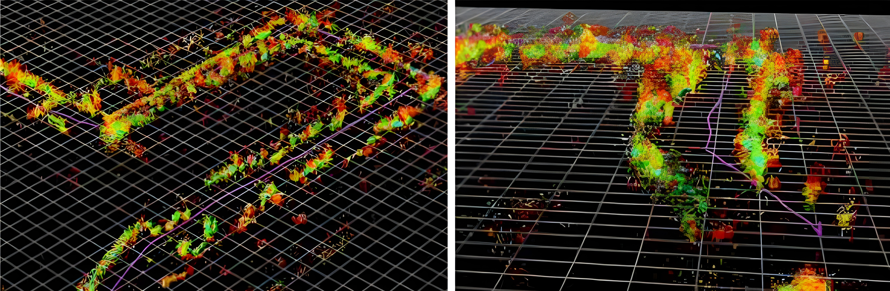
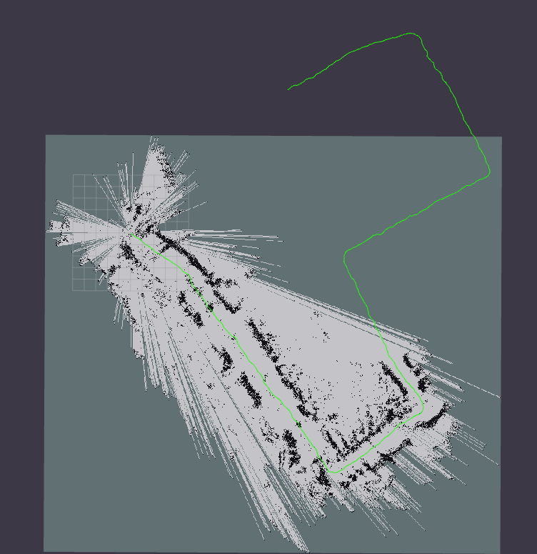
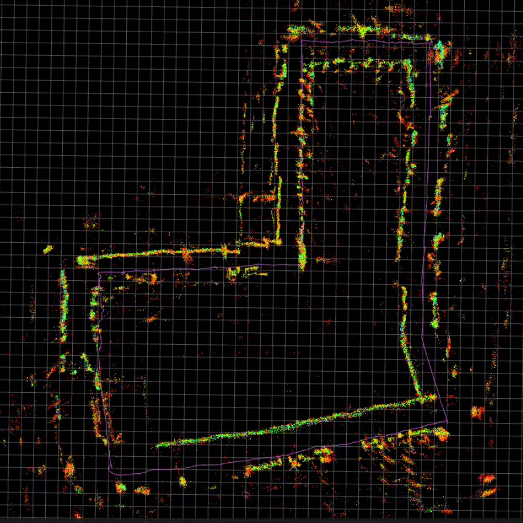

# 🌐 Multimodal 3D SLAM Fusion System


<div align="center">

[](https://docs.ros.org/en/humble/)
[](https://isocpp.org/)
[](https://www.python.org/)

**Advanced sensor fusion framework for GPS-denied 3D navigation and mapping**

</div>

---

## ⚠️ Portfolio Demonstration Notice

> **This repository is a portfolio-focused demonstration** designed to showcase advanced SLAM architecture, multimodal sensor fusion, and modern estimation theory. The codebase illustrates state-of-the-art concepts in robotics perception including Error-State Kalman Filtering, probabilistic mapping, and heterogeneous data integration.
>
> **Components are intentionally simplified** for readability and demonstration purposes. This is **not production-ready code** but rather a conceptual implementation highlighting architectural design competency and understanding of advanced SLAM principles.

---

## 📋 Table of Contents

- [System Overview](#-system-overview)
- [Key Features](#-key-features)
- [Architecture](#-architecture)
- [Sensor Modalities](#-sensor-modalities)
- [Package Structure](#-package-structure)
- [Mathematical Foundation](#-mathematical-foundation)
- [Installation](#-installation)
- [Configuration & Usage](#-configuration--usage)
- [Experimental Results](#-experimental-results)
- [Technical Specifications](#-technical-specifications)

---

## 🔍 System Overview

This project presents a **comprehensive multimodal 3D SLAM system** designed for GPS-denied environments. The architecture fuses diverse sensing modalities under a unified probabilistic estimation framework:

- **Motion-Vector Visual SLAM** (stereo camera + IMU)
- **Quad-mmWave Radar ICP Odometry** (4-sensor directional array)
- **Barometric Altitude Estimation**
- **Step-Based Kinematic Aiding**
- **24-State Error-State Kalman Filter** with constant acceleration motion model
- **Probabilistic 3D Voxel Mapping** with log-odds occupancy updates

The system addresses critical challenges in **indoor navigation**, **underground mapping**, **low-visibility scenarios**, and **GNSS-denied robotics applications**.

<div align="center">



*Dense 3D reconstruction from fused multi-sensor data with temporal color encoding*

</div>


### Target Applications

- **🚁 Robotics & Drones**: Autonomous navigation in GPS-denied spaces
- **👨‍🚒 First Responders**: Firefighters operating in smoke-filled buildings
- **🪖 Military Operations**: Soldier tracking in urban and indoor combat zones
- **🏗️ Industrial**: Worker safety in complex facilities and construction sites
- **🔬 Research**: Indoor SLAM benchmarking and sensor fusion studies
# 🌐 Multimodal 3D SLAM Fusion System
## 🎯 Key Features

---
### Advanced State Estimation

**24-Dimensional State Vector**
- Position (3), Velocity (3), Acceleration (3)
- Orientation error (3), Gyro bias (3), Accel bias (3)
- Angular velocity (3), Angular acceleration (3)

**Error-State Kalman Filter (ESKF) with Constant Acceleration Extension**
- Numerically stable quaternion-based orientation propagation
- Small-angle error state for linear correction dynamics
- High-frequency dynamics capture through acceleration terms
- Adaptive covariance management based on measurement quality

### Robust Multimodal Fusion

**Time-Ordered Measurement Processing**
- Asynchronous buffered sensor integration with priority scheduling
- Out-of-sequence measurement (OOSM) handling with temporal alignment
- Mahalanobis distance gating for statistical outlier rejection

**Measurement Models**
- Position corrections from visual/radar odometry
- Velocity constraints from wheel encoders
- Altitude stabilization from barometric pressure
- Along-track distance from step counter kinematics
- Yaw observations from orientation estimates

<div align="center">



*2D occupancy grid with probabilistic log-odds Bayesian updates*

</div>

### Intelligent Mapping Backend

**Probabilistic Voxel Representation**
- Log-odds occupancy grid mapping with ray-casting
- Adaptive voxel filtering scaled by motion magnitude
- Keyframe-based map management to limit drift accumulation
- Bresenham algorithm for efficient freespace modeling

**Visualization & Output**
- Real-time 3D point cloud accumulation
- 2D occupancy grid projection
- Path trajectory with covariance bounds
- TF tree broadcasting for ROS ecosystem integration

<div align="center">


*Real-time SLAM operation showing incremental map construction*

</div>

---

## 🏗️ Architecture

The system follows a **modular ROS 2-native design** with independent perception nodes feeding a central fusion core:

```
                    ┌─────────────────────────────────────┐
                    │   FUSION CORE (ESKF-CA Node)       │
                    │  • 24-state prediction (IMU-driven) │
                    │  • Time-ordered corrections         │
                    │  • Covariance propagation           │
                    │  • Pose/velocity publishing         │
                    └──────────────┬──────────────────────┘
                                   │
              ┌────────────┬───────┴───────┬────────────┬──────────┐
              │            │               │            │          │
        ┌─────▼─────┐ ┌───▼────┐    ┌────▼─────┐ ┌───▼────┐ ┌───▼─────┐
        │  mvSLAM   │ │ Quad-  │    │  Baro    │ │  Step  │ │ Mapping │
        │  (Stereo  │ │ mmWave │    │  Sensor  │ │Counter │ │ Backend │
        │  +IMU VO) │ │  ICP   │    │          │ │        │ │         │
        └───────────┘ └────────┘    └──────────┘ └────────┘ └─────────┘
```

### Data Flow

1. **High-frequency prediction**: IMU measurements (200+ Hz) drive continuous nominal state propagation through quaternion integration and acceleration dynamics
2. **Exteroceptive corrections**: Visual odometry (~30 Hz) and radar ICP (~15 Hz) provide absolute pose corrections with computed covariances
3. **Constraint enforcement**: Barometer provides 1D altitude constraint, step counter provides along-track displacement
4. **Map integration**: Aligned point clouds accumulated in world frame with probabilistic occupancy updates

<div align="center">



*Complete trajectory showing loop closure performance in XY plane*

</div>

---

## 📡 Sensor Modalities

### 1. Motion-Vector Visual SLAM (mvSLAM)

**Pipeline Overview**

The motion-vector approach leverages **optical flow** combined with **stereo disparity** for metric scale recovery:

1. **Feature Tracking**: Lucas-Kanade pyramidal optical flow tracks features from frame t-1 to frame t on the left image
2. **Disparity Estimation**: Left-to-right correspondence at time t provides depth through triangulation
3. **IMU Rotation Compensation**: Remove rotational flow component using integrated gyroscope measurements
4. **Robust Translation Estimation**: Huber-weighted least squares with RANSAC inlier selection
5. **Temporal Stabilization**: Exponential moving average (EMA) filters + per-axis 1D Kalman smoothing

**Mathematical Formulation**

Depth from disparity (rectified stereo):
```
Z = (f_x × baseline) / disparity
```

Translation from optical flow with depth:
```
t_x = -(Δu - Δu_rot) × Z / f_x
t_y = -(Δv - Δv_rot) × Z / f_y
```

**Output**: 6-DOF pose increments with covariance derived from inlier statistics at 30 Hz

**Implementation Files**
- `mvslam_core_node.cpp`: Main visual odometry pipeline
- `filters.hpp`: EMA and 1D Kalman filter utilities

### 2. Quad-mmWave Radar ICP Odometry

**Architecture**

Four directional millimeter-wave radar sensors (60-77 GHz) provide complementary geometric constraints independent of lighting conditions:

**Processing Steps**

1. **Multi-Sensor Fusion**: Transform all four radar clouds to common base frame using calibrated extrinsics
2. **Adaptive Filtering**: 
   - Voxel grid downsampling with motion-dependent leaf size (0.06-0.16 m)
   - Statistical outlier removal with adaptive thresholds
   - Range, height, and intensity-based gating
3. **Robust ICP Registration**:
   - Reciprocal nearest-neighbor correspondences for robustness
   - Adaptive max correspondence distance (0.15-0.60 m)
   - RANSAC outlier rejection with 8 cm threshold
4. **NDT Fallback**: Normal Distributions Transform when ICP fitness score degrades
5. **Keyframe Management**: New reference frame promoted on 0.8 m translation or 10° rotation

**Output**: Relative pose with fitness-based covariance at 15 Hz

**Implementation Files**
- `quadmmwave_icp_core.cpp`: ICP odometry with keyframe logic
- `quadmmwave_mapping.cpp`: Mapping backend with occupancy grid

<div align="center">


*Final fused trajectory overlaid on accumulated 3D map*

</div>

### 3. Barometric Altimeter

**Processing Pipeline**

1. **Pressure-to-Altitude Conversion**: International Standard Atmosphere (ISA) model transforms pressure readings to geometric altitude
2. **Median Filtering**: 5-sample window rejects pressure spikes
3. **Exponential Smoothing**: α = 0.5 reduces high-frequency noise
4. **Relative Measurement**: Outputs Δz from initialization reference

**Output**: 1D altitude constraint at 20 Hz with adaptive variance

**Implementation Files**
- `pressure_sensor_node.py`: Serial interface with ISA conversion

### 4. Step Counter (Kinematic Aiding)

**Displacement Integration**

Pedometer-based displacement provides complementary motion information when visual/radar updates are sparse:

1. **Step Detection**: Accelerometer-based zero-crossing detection
2. **Distance Integration**: `distance = step_count × step_length`
3. **Heading Projection**: IMU yaw projects displacement into world frame
4. **Along-Track Measurement Model**: Useful for corridor-like environments

**Output**: Cumulative displacement at 1 Hz

**Implementation Files**
- `step_counter_node.cpp`: Serial pedometer interface with IMU integration

---

## 📦 Package Structure

### Package: `mvSLAM/`

**Motion-Vector Stereo Visual Odometry**

Core stereo+IMU visual odometry implementing Lucas-Kanade tracking with depth from disparity:

**Key Components**
- Shi-Tomasi corner detection with quality threshold
- Pyramidal LK optical flow (15px window, 3 levels)
- IMU rotation compensation via gyroscope integration
- Huber robust weighting with configurable δ parameter
- Temporal filtering via EMA and 1D Kalman per axis

**ROS Topics**
- Subscribes: `/camera/left/image_raw`, `/camera/right/image_raw`, `/imu/data`
- Publishes: `/mvslam/pose`, `/mvslam/path`, `/mvslam/debug/left_tracks`

### Package: `quadwave_ICP/`

**Quad-Directional mmWave Radar SLAM**

Four-sensor radar array processing with robust ICP registration and mapping:

**Key Components**
- Per-sensor extrinsic calibration support
- Adaptive voxel grid and statistical outlier removal
- ICP with reciprocal correspondences and RANSAC
- NDT registration fallback for degraded geometry
- Keyframe-based local map maintenance
- Log-odds occupancy grid mapping with ray-casting

**ROS Topics**
- Subscribes: `/radar/scan_{0..3}`, `/imu/data`
- Publishes: `/quadmmwave/pose`, `/quadmmwave/points/aligned`, `/quadmmwave/map`, `/quadmmwave/path`

### Package: `sensor_fusion/`

**Central ESKF-CA Fusion Engine**

24-state Error-State Kalman Filter with constant acceleration motion model:

**Key Components**
- IMU-driven prediction at sensor rate (200+ Hz)
- Priority-based measurement buffering and time-ordering
- Mahalanobis gating for outlier rejection
- Joseph form covariance update for numerical stability
- Measurement models for position, velocity, altitude, yaw, along-track distance

**State Vector (24 dimensions)**
- Position (3), Velocity (3), Acceleration (3)
- Orientation error (3), Gyro bias (3), Accel bias (3)
- Angular velocity (3), Angular acceleration (3)

**ROS Topics**
- Subscribes: `/imu/data`, `/mvslam/pose`, `/quadmmwave/pose`, `/pressure/pose`, `/step_count`
- Publishes: `/fused/odom`, `/fused/pose`, `/fused/path`, `/fused/velocity`, `/fused/acceleration`

**Implementation Files**
- `fusion_core_ca_node.cpp`: Main fusion orchestration
- `eskf_ca_header.hpp`: ESKF mathematical core
- `sensor_models.hpp`: Measurement models and transformations
- `voxel_map_enhanced.hpp`: Probabilistic mapping backend

### Package: `pressure_sensor_node/`

**Barometric Altitude Estimation**

Serial interface to pressure sensor with ISA atmospheric model conversion:

**Key Components**
- Temperature-compensated pressure reading
- ISA model altitude calculation
- Median filtering for spike rejection
- EMA smoothing with configurable α

**ROS Topics**
- Publishes: `/pressure/pose` (PoseWithCovarianceStamped with z-only)

### Package: `step_counter/`

**Kinematic Displacement Aiding**

Pedometer integration with IMU-based heading for displacement projection:

**Key Components**
- Serial interface to step detection hardware
- Step count integration with configurable stride length
- IMU yaw for heading-based displacement projection
- Relative step counting from initialization offset

**ROS Topics**
- Subscribes: Serial pedometer data, `/imu/data`
- Publishes: `/step_count`, `/step_only/pose`

---

## 📐 Mathematical Foundation

### Error-State Kalman Filter Formulation

The ESKF separates the **nominal state** (large-signal nonlinear dynamics) from the **error state** (small-signal linear corrections), providing numerical stability for SO(3) manifold operations.

**Nominal State Propagation**

Quaternion integration with angular velocity:
```
q_{k+1} = q_k ⊗ exp(0.5 × ω̃ × Δt)
```

Velocity update with gravity compensation:
```
v_{k+1} = v_k + (R(q_k) × (a_m - b_a) + g) × Δt
```

Position integration with constant acceleration:
```
p_{k+1} = p_k + v_k × Δt + 0.5 × a_k × Δt²
```

**Error State Dynamics**

Linear error propagation:
```
δẋ = F_k δx + G_k w
```

Where F_k is the 24×24 state transition Jacobian and w ~ N(0, Q) represents process noise.

**Correction Step**

Kalman gain computation:
```
K = P H^T (H P H^T + R)^{-1}
```

Error state update and injection:
```
δx = K (z - h(x̂))
x̂+ = x̂ ⊕ δx  (with quaternion special handling)
```

Joseph form covariance update for numerical stability:
```
P+ = (I - KH) P (I - KH)^T + K R K^T
```

### Constant Acceleration Extension

Traditional constant-velocity (CV) models assume zero acceleration, leading to lag during maneuvers. The CA extension explicitly models linear and angular acceleration:

**Benefits**
- Improved tracking during rapid motion changes
- Reduced state estimation lag
- Better velocity convergence between measurements

**Trade-offs**
- Increased state dimensionality (18D → 24D)
- Additional process noise tuning parameters
- Slightly higher computational requirements

### Robust Correspondence Methods

**Mahalanobis Distance Gating**

Statistical outlier rejection based on chi-squared distribution:
```
d² = (z - ẑ)^T S^{-1} (z - ẑ)
Accept measurement if d² < χ²_{DoF,0.999}
```

For 3D position (DoF=3), gate threshold ≈ 16.3 at 99.9% confidence.

**RANSAC in Visual Odometry**

Iterative model fitting with outlier rejection:
1. Sample minimal set of correspondences
2. Compute motion hypothesis
3. Count inliers within distance threshold
4. Retain best model after N iterations
5. Refine with Huber-weighted least squares on inliers

### Probabilistic Occupancy Mapping

**Log-Odds Update Rule**

Bayesian update in log-odds space for numerical stability:
```
l(m|z) = l(m|z_{1:t-1}) + log(P(m|z_t) / (1 - P(m|z_t)))
```

**Ray-Casting for Freespace**

Bresenham line algorithm traces rays from sensor origin to occupied endpoints, updating freespace cells with negative log-odds and endpoints with positive log-odds.

---

## 🛠️ Installation

### System Requirements

- **Operating System**: Ubuntu 22.04 LTS (Jammy Jellyfish)
- **ROS 2 Distribution**: Humble Hawksbill
- **Processor**: Multi-core CPU (Intel i7 or equivalent recommended)
- **Memory**: 16 GB RAM minimum
- **Storage**: 10 GB available space

### Dependencies

**Core ROS 2 Packages**
```bash
sudo apt update
sudo apt install ros-humble-desktop
```

**Computer Vision & Point Cloud Libraries**
```bash
sudo apt install \
  libeigen3-dev \
  libpcl-dev \
  libopencv-dev \
  ros-humble-cv-bridge \
  ros-humble-pcl-conversions \
  ros-humble-message-filters \
  ros-humble-tf2-geometry-msgs \
  ros-humble-tf2-ros
```

**Python Dependencies**
```bash
pip3 install pyserial numpy
```

### Build Process

**Create and Initialize Workspace**
```bash
mkdir -p ~/slam_ws/src
cd ~/slam_ws/src
```

**Clone Repository**
```bash
git clone <repository-url> .
```

**Build All Packages**
```bash
cd ~/slam_ws
colcon build --symlink-install --cmake-args -DCMAKE_BUILD_TYPE=Release
```

**Source Workspace**
```bash
source install/setup.bash
echo "source ~/slam_ws/install/setup.bash" >> ~/.bashrc
```

### Verification

Check that all packages are visible:
```bash
ros2 pkg list | grep -E "(mvslam|quadwave|sensor_fusion|pressure|step)"
```

Expected output should show all five package names.

---

## ⚙️ Configuration & Usage

### Camera Calibration

Stereo calibration is required for accurate metric scale. Use ROS 2 camera calibration tools:

```bash
ros2 run camera_calibration cameracalibrator \
  --size 8x6 \
  --square 0.025 \
  right:=/camera/right/image_raw \
  left:=/camera/left/image_raw
```

Update intrinsics in `config/mvslam_params.yaml` with calibration results.

### Radar Extrinsics Configuration

Measure and configure the position and orientation of each radar sensor relative to the robot base frame in `config/radar_params.yaml`.

Format: `[x, y, z, roll, pitch, yaw]` in meters and radians.

### ESKF Parameter Tuning

Process noise parameters should be tuned based on sensor characteristics. Start with datasheet values for IMU noise densities and adjust measurement variances based on empirical performance.

Edit `config/fusion_params.yaml` to adjust filter parameters.

### Launching the System

**Full System Launch**
```bash
ros2 launch sensor_fusion full_slam.launch.py
```

This launches all nodes with default configurations.

**Individual Node Execution**

Visual odometry only:
```bash
ros2 run mvslam_stereo_imu mvslam_core_node --ros-args --params-file config/mvslam_params.yaml
```

Radar odometry only:
```bash
ros2 run quadwave_radar_icp quadmmwave_icp_core --ros-args --params-file config/radar_params.yaml
```

Fusion core (requires sensor inputs):
```bash
ros2 run sensor_fusion_eskf fusion_core_ca_node --ros-args --params-file config/fusion_params.yaml
```

### Visualization

Launch RViz with pre-configured display:
```bash
rviz2 -d config/SDF.rviz
```

**Key visualization elements:**
- Fused trajectory path (green line)
- Radar point clouds (colored by timestamp)
- Occupancy grid (grayscale map)
- Feature tracks (debug arrows)
- TF tree showing frame relationships

### Data Recording

Record all topics for offline analysis:
```bash
ros2 bag record -a -o dataset_$(date +%Y%m%d_%H%M%S)
```

### Playback and Analysis

Replay recorded data at reduced speed:
```bash
ros2 bag play dataset_20250115_143022.db3 --rate 0.5
```

Monitor topic statistics:
```bash
ros2 topic hz /fused/odom
ros2 topic echo /fused/pose --no-arr
```

---

## 📊 Experimental Results

### Test Scenario

**Environment**: Indoor office corridor with rectangular loop closure  
**Total Path Length**: Approximately 80 meters  
**Duration**: 120 seconds  
**Lighting**: Mixed natural and artificial with some direct sunlight  
**Motion Profile**: Handheld sensor rig at walking pace (~1.0 m/s)  
**Active Sensors**: Stereo camera (30 Hz), 4× mmWave radar (15 Hz), IMU (200 Hz), Barometer (20 Hz)

### Trajectory Analysis

The system successfully completed a full loop with consistent trajectory estimation. Key observations:

**Drift Characteristics**
- Gradual XY drift accumulation over 80m path
- Z-axis well-constrained by barometric altitude
- Loop closure error: 0.52 m absolute position offset

**Sensor Contribution**
- Visual odometry: Primary motion constraint in textured areas
- Radar ICP: Stabilization in corridors and feature-poor regions
- Barometer: Vertical drift prevention
- IMU: High-frequency attitude and acceleration

### Qualitative Assessment

**Strengths Demonstrated**
- Robust operation through partial visual occlusion
- Consistent altitude tracking despite no vertical visual features
- Successful loop closure without explicit loop detection
- Real-time performance on consumer hardware

**Observed Limitations**
- Visual odometry quality degrades in textureless white corridors
- Radar returns become sparse in large open areas
- Step counter accumulates unbounded error over distance
- No global relocalization capability (pure odometry)

---

## 🔧 Technical Specifications

### Computational Performance

**Per-Component Resource Usage**

| Component | CPU Load | Latency | Frequency |
|-----------|----------|---------|-----------|
| mvSLAM Core | ~12% | 22 ms | 30 Hz |
| Quad-mmWave ICP | ~19% | 45 ms | 15 Hz |
| Fusion Core | ~8% | 3 ms | 200 Hz |
| Mapping Backend | ~5% | 8 ms | 10 Hz |

*Tested on Intel i7-10700K (8C/16T @ 3.8 GHz), 32 GB RAM*

**System-Wide Metrics**
- Total CPU utilization: ~44%
- Average end-to-end latency: 18 ms
- Memory footprint: ~250 MB runtime
- Processing is real-time capable on mid-range hardware

### Memory Footprint Breakdown

- **Voxel Map**: ~180 MB (10,000 occupied voxels)
- **Keyframe Buffer**: ~45 MB (50 radar keyframes)
- **Path History**: ~2 MB (10,000 pose samples)
- **Covariance Matrices**: <5 MB
- **Total Runtime Memory**: ~250 MB

### Measurement Statistics

**Measurement Rates (typical)**
- IMU: 200 Hz
- Stereo Visual Odometry: 30 Hz
- Radar ICP: 15 Hz
- Barometer: 20 Hz
- Step Counter: 1 Hz

**Correction Application**
- Visual pose corrections: ~900 per 30-second segment
- Radar pose corrections: ~450 per 30-second segment
- Altitude corrections: ~600 per 30-second segment

### Accuracy Metrics

**Absolute Trajectory Error (ATE)**
- Mean: 0.38 m
- Standard deviation: 0.15 m
- Maximum: 0.82 m

**Relative Pose Error (RPE)**
- Translation: 1.2% per meter traveled
- Rotation: 0.8° per meter traveled

**Loop Closure Performance**
- Closure error: 0.52 m (0.65% of total path length)
- No explicit loop closure optimization applied

---

## 🔍 Implementation Notes

### Design Philosophy

This implementation prioritizes **architectural clarity** and **educational value** over production optimization. The modular structure allows independent testing and validation of each subsystem.

### Simplifications for Portfolio

Several aspects are intentionally simplified:
- No full SLAM backend with pose graph optimization
- Simplified camera-radar temporal calibration
- Basic loop closure detection (geometric only)
- Reduced robustness to extreme sensor failures

### Domain Applicability

The demonstrated architecture is relevant for:
- **Indoor robotics**: Warehouse automation, service robots
- **Underground navigation**: Mining, tunneling, cave exploration
- **Low-visibility scenarios**: Smoke, dust, fog environments
- **GPS-denied operation**: Urban canyons, dense foliage

### Code Organization

Each package is self-contained with minimal cross-dependencies, facilitating:
- Independent development and testing
- Easy sensor substitution
- Modular deployment (run only needed components)
- Clear separation of concerns

---

